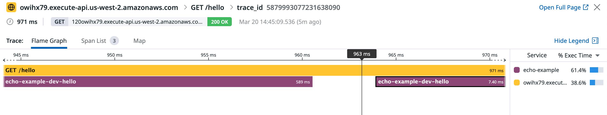

## Tools needed
- [serverless framework tool](https://www.serverless.com/) installed
- AWS account
- Datadog account and API key

## Deploy
`cd hello && ./build.sh`
Note: the golang mod is in hello directory.
`cd ..`
Then
`DATADOG_API_KEY={} serverless deploy`

## Datadog Trace view

## How the project was set up
This project was generated by running
`serverless create --template aws-go --name echo-example` to setup some scaffolding for serverless framework.

Then run `serverless plugin install --name serverless-plugin-datadog` to install tools to auto-instrument the lambda.

Then to keep each go mod separated.
first `cd hello`
then `go mod init hello`
`go get github.com/aws/aws-lambda-go/lambda`
`go get github.com/aws/aws-lambda-go/events`
`go get github.com/DataDog/datadog-lambda-go`
`go get github.com/awslabs/aws-lambda-go-api-proxy`
etc

And update the serverless.yml accordingly.
